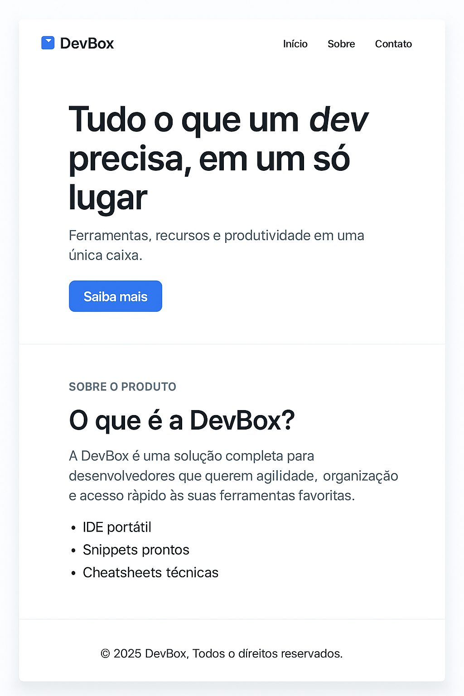
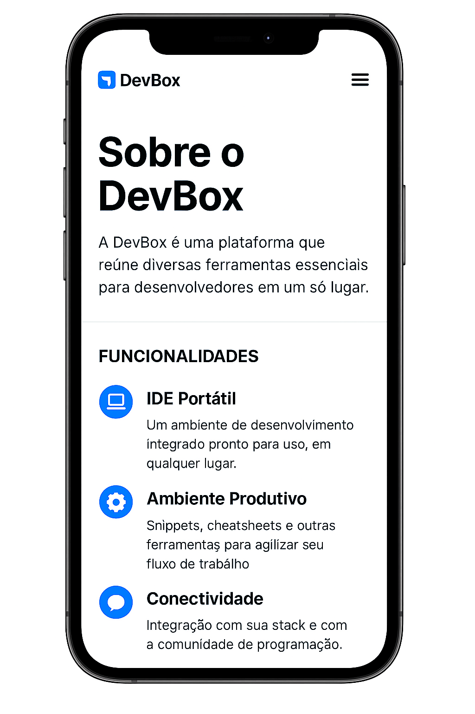

# 💻 DevBox
[](https://www.w3.org/html/)
[](https://www.w3.org/Style/CSS/)
[](https://getbootstrap.com/)
[](https://www.javascript.com/)

Plataforma web responsiva que reúne ferramentas essenciais para desenvolvedores.

---

## 📌 Sobre o projeto

O **DevBox** é uma landing page fictícia criada com foco em estrutura, responsividade e clareza.  
Ela simula um produto voltado para desenvolvedores, oferecendo uma experiência limpa e funcional, sem dependência de frameworks ou JavaScript.

---

## 🧱 Funcionalidades

- Página **Início** com apresentação do produto
- Aba **Sobre** com descrição e funcionalidades
- Aba **Contato** com formulário simples
- Layout **responsivo** para desktop e mobile
- Design limpo com HTML e CSS puro

---

## 🛠️ Tecnologias utilizadas

- HTML5
- CSS3 (Flexbox e Media Queries)

---

## 📱 Layout responsivo

O projeto foi desenvolvido com abordagem **mobile-first**, garantindo boa visualização em diferentes tamanhos de tela.

---

## 📷 Prévia do projeto

### Versão Desktop


### Versão Mobile


---

## 🚀 Como executar

1. Clone o repositório:
   ```bash
   git clone https://github.com/seu-usuario/devbox.git
    ```
2. Acesse a pasta do projeto:
   ```bash
   cd devbox
    ```
3. Abra o arquivo index.html no navegador.

## 📄 Licença
Este projeto está sob a licença MIT. Veja o arquivo LICENSE para mais detalhes.

## 👨‍💻 Autor
<p>Feito com 💙 por Robert Douglas </p>
<strong>
    <a href="https://www.linkedin.com/in/robertdouglas2000" target="_blank">LinkedIn</a> • 
    <a href="https://r-douglas.vercel.app" target="_blank">Portfólio •</a> 
    <a href="https://github.com/robertdouglasaimon" target="_blank">GitHub</a>
</strong>